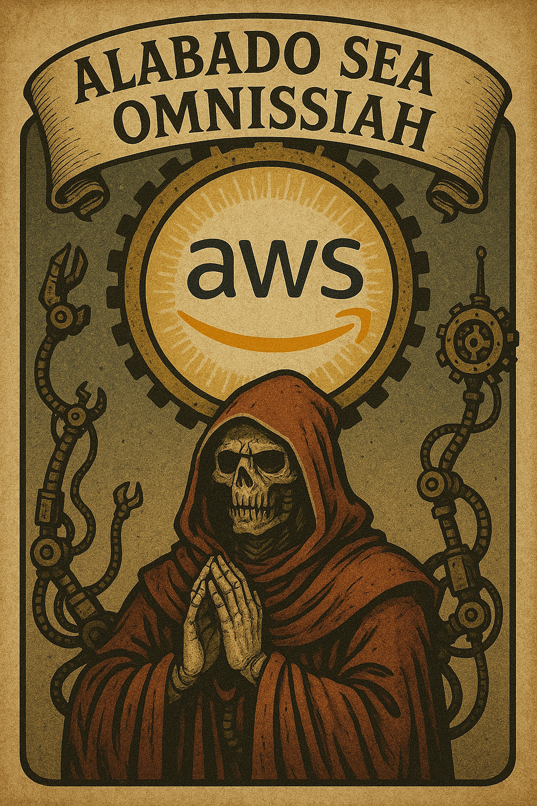

---
title: Gitlab Runners, AWS Spot, Socotrocos
description: Una de las cosas lindas que me toco hacer es que los runners de Gitlab utilicen instancias Spot, te cuento...
slug: aws-spot-runners
date: 2025-11-11 00:00:00+0000
image: cover.jpg
tags:
    - devops
categories:
    - devops
---

Para que me puedan seguir vamos a tener que alinearnos en algunas definiciones y aclarar algunos puntos...

## Definiciones

- **AWS**: Amazon Web Services — el conjunto de servicios en la nube de Amazon. Incluye servidores, almacenamiento y redes que puedes usar por demanda sin comprar hardware.

- **AWS EC2 (Elastic Compute Cloud)**: servicio para crear y ejecutar máquinas virtuales (instancias). Aquí instalas sistemas operativos, software y ejecutas cargas de trabajo.

- **CI/CD**: Integración Continua y Entrega/Despliegue Continuo.  
    - CI: cada cambio de código se compila y se prueba automáticamente.  
    - CD: una vez que pasa las pruebas, el artefacto se entrega o despliega automáticamente a entornos (staging/producción).

- **Runner (GitLab Runner)**: servicio que ejecuta los jobs de CI/CD (compilar, testear, empaquetar, desplegar). GitLab envía jobs al runner y este los ejecuta dentro de contenedores Docker, aislando todo para que no se rompan cosas.

- **Runner Manager / Coordinador**: servicio que orquesta todo el circo de runners dinámicos en la nube. Escucha a GitLab, ve qué onda con los recursos disponibles y crea o destruye runners según lo que necesite en cada momento.

- **Plugin Fleeting (`fleeting-plugin-aws`)**: el teléfono del Runner Manager para hablar con AWS. Le permite solicitar máquinas nuevas, monitorearlas y terminarlas cuando se acabó el laburo. Automatiza todo ese circo para que el Runner Manager no tenga que llorar pidiendo máquinas a mano.

- **EC2 Spot Instance**: instancia EC2 con un descuento importante respecto al precio bajo demanda. A cambio, AWS puede terminarla con poco aviso si necesita recuperar capacidad. Ideal para trabajos tolerantes a interrupciones y para ahorrar dinero.

- **ASG (Auto Scaling Group)**: grupo que gestiona una flota de instancias EC2: crea, elimina y reemplaza instancias según políticas de escalado y chequeos de salud. Útil para mantener disponibilidad y ajustar capacidad automáticamente.

## Aclaraciones

Voy a describir los resultados de varias iteraciones: qué se implementó y qué problemas solucionó. No pretende ser la única ni la mejor forma de hacerlo; existen muchas alternativas y esta experiencia está ligada a un contexto que no puedo compartir por completo. Tómenlo como referencia, no como una receta definitiva.

## Alabado sea el Omnissiah

Frase que he repetido mucho en este proceso, aunque los que no saben sobre Warhammer 40k se me queden mirando y pensando "Uh, está gaga". El que ha levantado infraestructuras completas, ha renegado con una migración, ha realizado tareas de devops o todas a la vez, entiende esa satisfacción de ver todo funcionando y pensando en lo siguiente a refactorizar o meter mano cuando ya andaba bien como un desquiciado.

Como esta hermosa imagen que me cruce alguna vez y nunca pude olvidar.


### Contexto

Vamos con contexto. Los runners corrían en un servidor compartido con otros servicios. Recursos finitos. Proyectos creciendo. Pipelines cada vez más lentos. El resultado: pérdida de tiempo y dinero.

La cuestión empieza acá, donde ampliar hardware implica dinero. Y la pregunta es ¿cómo ampliamos, horizontalmente o verticalmente?

Para el que nunca escuchó esto... Ya ya, Cundita explica todo. En simples palabras, ampliar verticalmente es al servidor que ya tengo, meterle más fierro (bien criollo el término, ¿vio'?). Crecer horizontalmente es poner un servidor al lado y que se pongan tímidos.


### ¿Opciones?

Para no hacerlos perder tiempo: si ampliamos el hardware, solucionamos el problema temporalmente. Pero escalar no es barato, y las opciones simples (misma instancia con más potencia) no justificaban la inversión. Poner dos servidores tampoco era la solución: ahora tenías que mantener dos máquinas en lugar de una.

Para explicarlo con una analogía de Warhammer -hoy estoy a full, hace rato no tengo tiempo para viciar, sepan entender- 

En ese momento era como Tech-Priest del Adeptus Mechanicus y necesitaba potencia de cálculo para simular patrones de disformidad. Mis opciones eran:

🟥 Opción 1: Servidor On-Demand
Es como tener tu propio [Cogitador](https://warhammer40k.fandom.com/es/wiki/Cogitador) de Núcleo Dedicado encendido todo el día en tu taller.
- Siempre disponible.
- Confiable.
- Pero consume recursos sagrados constantemente (muchos créditos imperiales).
- Ideal para tareas críticas o persistentes.

---

🟩 Opción 2: Instancia Spot con mucho hardware
Es como pedir [servitors](https://warhammer40k.fandom.com/wiki/Servitor) de mundos forja.
- Están ociosos, esperando tareas.
- Son baratos, porque nadie más los está usando.
- Los "pido" con un solo propósito (en este caso).
- Vienen con potencia bruta: CPU, RAM, GPU, lo que necesites.
- Pero si el Omnissiah los reclama para otra misión, desaparecen sin aviso (raspando la referencia, JA).


### Contexto - Presupuesto

Sin entrar en detalle del porqué, el presupuesto máximo era gastar 100 dólares por mes. Con las opciones clásicas de escalamiento, nos pasábamos del presupuesto sin ni siquiera resolver el problema.

Acá apareció la magia de correr los jobs en una Instancia Spot.

SPOILER: terminamos alquilando el triple de hardware que las instancias que usamos, dedicado solo a los jobs gastando menos de 20 dolares mensuales.

## Ahora sí... el cómo

La idea principal es entender que un runner ejecuta los jobs de tu pipeline. Dependiendo del contexto, un runner puede procesar múltiples jobs en simultáneo, o podés tener varios runners trabajando en paralelo. Todo depende de lo que necesites.

Voy a explicar esto con analogías (sin warhammer esta vez, al menos lo intentaré).

### Runners Manager con Fleeting y ASG

Imaginemos que tenemos una **fábrica de trabajos** (los pipelines de GitLab). Algunos días tenemos montones de trabajo, otros días casi nada. No tiene sentido tener máquinas costosas funcionando 24/7 si solo las necesitamos a veces. Sin mencionar que las máquinas que podemos tener 24/7 nos están quedando "chicas".

Por eso existe este sistema: **máquinas que aparecen cuando las necesitas y desaparecen cuando no las usas** (por si no se entendió cómo es una máquina spot con mi referencia a Warhammer). Es como contratar trabajadores temporales en lugar de empleados fijos.

Ahora bien, veamos cómo funciona todo esto en la práctica.

#### Los personajes principales

##### 1. **El Runner Manager** (el capataz)

Es un contenedor Docker que corre en tu servidor principal. Su único trabajo es:

- Escuchar a GitLab: "Che, tengo un job nuevo que ejecutar"
- Mirar el ASG: "¿Cuántas máquinas tenemos disponibles?"
- Decidir: "Necesito más máquinas, voy a crearlas"
- Distribuir trabajo: "Vos, la máquina nueva, ejecuta este job"

> **Nota:** Los jobs se ejecutan dentro de contenedores Docker en cada máquina Spot. Esto permite aislar dependencias, versiones de software y ambiente de ejecución para cada job. En nuestro caso decidimos meterlo todo en Docker; en otros contextos puede ser diferente.

##### 2. **El Plugin Fleeting** (el asistente del capataz)

Es una extensión que le da superpoderes al Runner Manager. Le permite:

- Hablar con AWS
- Decirle: "Crea 5 máquinas nuevas, por favor"
- Decirle: "Esas máquinas que creamos hace 10 minutos, ya no las necesitamos, elimínalas"

##### 3. **El ASG** (Auto Scaling Group) - El almacén de máquinas

Es un servicio de AWS que:

- Guarda la "receta" de cómo crear máquinas (qué tipo, qué sistema operativo, etc.)
- Mantiene un grupo de máquinas listas
- Puede crear y eliminar máquinas automáticamente

##### 4. **Las Spot Instances** (empleados temporales baratos)

Son máquinas EC2 normales pero con un descuento BRUTAL -en una charla dije que son los "flybondi" de las aerolíneas-. El único problema: AWS puede decir "necesito esta máquina, adiós" sin avisar.

#### **Paso a paso desde que ejecutas un pipeline:**

```
1️⃣  PIPELINE INICIADO
    └─ Desarrollador hace push a GitLab
    └─ GitLab crea un "job" (una tarea)
    └─ GitLab dice: "Runner Manager, tengo un job para ti"

2️⃣  EL RUNNER MANAGER ESCUCHA
    └─ "Hola GitLab, estoy aquí. Dame el job"
    └─ GitLab describe qué necesita (compilar, test, desplegar, etc.)
    └─ Runner Manager pregunta: "¿Tengo máquinas disponibles?"

3️⃣  DECISIÓN: ¿Máquinas disponibles?
    
    SI HAY MÁQUINAS LIBRES → Usa una de inmediato
    │
    NO HAY → El Plugin Fleeting entra en acción:
    │       ├─ "AWS, dame máquinas nuevas por favor"
    │       ├─ ASG dice: "Voy a crear 3 máquinas Spot"
    │       ├─ AWS lanza las máquinas (30-60 segundos)
    │       └─ Las máquinas se registran con el Runner Manager
    │
    └─→ El Runner Manager le asigna el job a una máquina

4️⃣  MÁQUINA EJECUTA EL JOB
    └─ La máquina EC2 descarga el código
    └─ Corre los tests, compilaciones, despliegues, etc.
    └─ Envía los resultados a GitLab
    └─ ✅ Job terminado

5️⃣  LIMPIEZA (ahorro de dinero)
    └─ La máquina queda "idle" (sin hacer nada)
    └─ Runner Manager cuenta el tiempo: 
    │   └─ En nuestro contexto, en horario laboral las máquinas tienen mayor tiempo en IDLE que fuera de horario laboral. Así ahorramos tiempos y dinero.
    │
    └─ Se acabó el tiempo → "AWS, elimina esa máquina"
    └─ La máquina desaparece
    └─ 💰 Dejas de pagar por ella
```


#### Resumen en 3 puntos

1. **Runner Manager = Director de orquesta**: Escucha a GitLab, ve si hay máquinas, y decide qué hacer.

2. **Fleeting Plugin = Teléfono a AWS**: Le dice a AWS cuándo crear y eliminar máquinas.

3. **ASG = Banco de máquinas**: Guarda la receta y crea/elimina máquinas cuando se lo piden.

**Resultado: Máquinas que aparecen cuando las necesitas, desaparecen cuando no, y ahorras mucho dinero.** 🚀


## Para cerrar

Implementar esto no fue trivial ni barato, pero valió totalmente la pena. Pasamos de renegar todos los días con runners saturados y sufrir los cuellos de botella a un sistema que **escala automáticamente según la demanda real**.

> **Y lo mejor:** gastamos **menos de $20 mensuales** en lugar de los **$100+** que costaba mantener la infra anterior.

### El aprendizaje más importante

La gran lección de todo esto fue entender que **no siempre necesitas lo mejor**, sino **lo justo en el momento justo**. Y eso es lo hermoso de la nube cuando la aprovechas bien. No se trata de tener la máquina más poderosa corriendo 24/7, sino de tener exactamente lo que necesitas, cuando lo necesitas.

### Seguimos iterando

Claro que hay oportunidades de mejora. Hay más soluciones en la nube para explotar, pero de eso se trata: **iterar**. Así como antes pasamos de servers chicos a VMs en la nube, optimizamos los pipelines conforme crecían, y le dimos distintas misiones a runners diferentes para aprovechar mejor los recursos... ahora toca seguir puliendo.

La infraestructura es una obra viva, no un producto terminado. 🔧

Y obviamente... verlo funcionar en vivo y en tiempo real es esa satisfacción que solo se puede expresar así: "ALABADO SEA EL OMNISSIAH" 🙏

