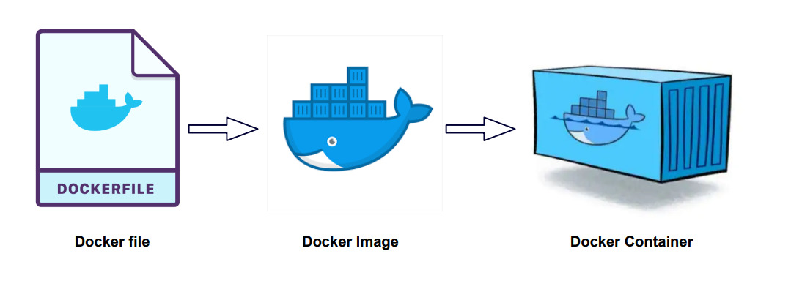

## I WANT YOU ON DOCKER

Si estás leyendo esto, posiblemente es porque te mandé el link de este post. Y esto puede ser por dos razones: o te pasé el link solo para presumir de una analogía que me inyectó un chop de dopamina, o sos un dev (de cualquier nivel) que no utiliza o no sabe docker y eso me irrita. Master, dejá de instalar esa fucking DB que después te queda consumiendo recursos en segundo plano, te llena el Windows de basura, o si sos un usuario de Linux posiblemente tampoco sepas como arreglártelas bien para solucionar este problema (o sí, pero si sabés bien linux y no docker posiblemente seas de la vieja escuela, te respeto, PERO LEVANTÁ CONTENEDORES).

> Créanme que cuando te acostumbrás a Docker no hay vuelta atrás, es una herramienta que vas a considerar para desarrollar, hostear aplicaciones y experimentar de manera rápida y segura.

Arranquemos con los problemas, porque, al fin y al cabo, ¿no resolvemos problemas?

## ¿Problemas? A los problemas deciles "No me importa"

> *Dios mío, cómo extraño Les Luthiers*

Seguramente en algún momento de tu vida te pasaron alguna o todas de las siguientes cosas:

- Querías levantar un proyecto **NodeJS/Java/Python** y estuviste más tiempo tratando de ejecutarlo en tu sistema que haciendo lo que necesitabas. Lo más común:
  - El proyecto requiere **NodeJS 14** pero vos tenés la **20** o **22** en tu máquina. Instalaste `nvm` y ahora se te rompió algo que estaba ejecutándose en tu sistema con la versión de Node que tenías activada.
  - Lo mismo que lo anterior pero renegando con las versiones de Python o Java (Igual esto es parte del arte de programar en python ya). O bien, te cansaste de tener binarios por todos lados con cada versión y dependencia de cada proyecto.
- Necesitabas una Base de datos y la instalaste en tu máquina, después te diste cuenta que no era la versión que necesitabas o le faltan plugins.
- Tuviste que formatear porque te hiciste el guapo tocando el kernel de linux (no voy a admitir nada) y ¿ahora? no pudiste salvar el S.O., decidís formatear y PUM... *"¿Cómo carajos había configurado todo para este proyecto?"*
- O caíste en el Cliché que te digan o vos digas *"En mi máquina andaba"* ¯\\_(ツ)_/¯

## WIIFM: What's In It For Me

Antes de meter mano y explicar algo, repasemos por qué nos conviene saber Docker (además de que una monita china te lo pide en este post).

1. **Independencia:** No necesitás esperar a que el equipo de Infra/DevOps te prepare un entorno. Lo manejás vos.
   > *Spoiler: igual vas a renegar con el equipo de Infra/DevOps, son gajes del oficio*

2. **Onboarding Instantáneo:** Un nuevo dev entra al equipo. En lugar de leer un `README.md` de 50 pasos para instalar librerías, solo corre un comando. Listo... como dicen los jóvenes de ahora... GG IZI.

3. **Limpieza Mental (y de Disco):** ¿Necesitás Redis para probar algo? No lo instales en tu sistema operativo, eso te trajo hasta acá. Corré un contenedor, usalo, y borralo sin dejar rastro.

4. **Paridad Dev/Prod:** Si funciona en tu contenedor Docker, funcionará en el servidor (el 99.9% de las veces, **éxito no garantizado**).

## Conceptos Básicos

No pretendo dar un curso demasiado abarcativo, en realidad sí, pero no en este lugar. Vamos directo "a los bifes". 

### analogia.dockerfile

Si hay una analogía que siempre funciona (y si funciona, no se toca) es entender docker en el contexto de una cocina.

1. **Dockerfile (La Receta)**: Es un archivo de texto donde listás los ingredientes (sistema operativo base, librerías... *¿Me das medio kilo de sistema operativo?*) y los pasos (copiar código, compilar). Esto es la base de todo.

2. **Imagen (El Plato Congelado)**: Es el resultado de seguir la receta. Es un paquete inmutable que tiene todo lo necesario para ejecutarse. Ese plato congelado se lo podemos dar a alguien y ambos tendrían lo mismo (usen la imaginación, por favor).

3. **Contenedor (El Plato Cocinado)**: Es cuando ponés a "correr" esa imagen. Es la aplicación viva. Podés tener muchos contenedores de la misma imagen corriendo a la vez.

Lo gracioso es que hay una posibilidad de que ya conozcas el punto 2 y 3, sin saber el 1. Eso es algo cada vez más común en este rubro, como cuando creás un endpoint sin saber cómo funciona, utilizás un ORM sin saber por qué ni qué significa o tantos escenarios más que las mentes sin curiosidad se pierden de un mundo de posibilidades (¿Quién se creía este flaco?). Si esto te resuena, ¿qué pensás que pasaba cuando hacías algo como `docker run blablablablabla node:22`? ¿O puede ser que en el `README` del proyecto te decían "mandate un `docker compose up`"?

De todos modos, sigamos entendiendo docker con más analogías que ya perdí la fe en la humanidad y si no se van de acá sin aprender algo voy a considerar darme la frente con el borde del escritorio (Que es de [Guayubira](https://www.argentinaforestal.com/2025/05/03/conoce-al-arbol-de-guayubira/)... va a doler).

Vamos con algo retro, si te considerás una persona joven... bueno... echale ganas, mijo...

#### Emulador de NES

Muchos de nosotros, alguna vez, nos descargamos algún emulador (hoy en día vienen todo plug-and-play cuando te bajás el Zelda para Nintendo en un exe "100% real no fake"... Suerte con eso...). Si queremos jugar al **Super Mario** posiblemente tendremos que hacer los siguientes pasos:

1. **Bajar el emulador** (el que se les ocurra o encuentren en google). En el mundo de docker, esto sería el equivalente a instalar [Docker Engine](https://docs.docker.com/engine/), el corazón de todo esto.
   > Acá hago un spoiler y ayuda si están en **LINUX**: por favor, en serio, POR FAVOR, no parezcan más junior de lo que cada uno es y lean las documentaciones, hoy en día no hace falta leer todo, ya que son bastante guiadas. Hagan los pasos [post instalación](https://docs.docker.com/engine/install/linux-postinstall/).
2. **Bajar el juego**, supongamos `SuperMarioTotalmenteLegal.nes`. Este `.nes` sería nuestra imagen Docker, lo que descargan, como diría un filósofo contemporáneo, "auto-magicamente". Algunos ejemplos de cuándo pasa esto:
   - Si hicieron algo como `docker pull ...` están descargando una imagen.
   - Si hicieron algo como `docker run ...` muy posiblemente estén descargando una imagen o ya la habían descargado.
   - Aplica lo mismo para `docker compose` (ya hablaremos de esto).
3. Cuando el juego está corriendo y estamos disfrutando con toda la nostalgia, tenemos nuestro `contenedor`. El **contenedor** es nuestra partida en curso, está ocupando recursos (CPU, RAM), está almacenando info con los "Save State" (vayan reflexionando... ¿Dónde se guarda esta info? ¿En nuestro disco?).
4. Si nuestro juego explota por la razón que sea, lo reiniciamos y listo. Nuestra PC con nuestro sistema operativo todo frágil no sufre las consecuencias (por lo general jeje).

Ahora, ¿y el `Dockerfile`? esa imagen que descargamos es el resultado de un `Dockerfile`. Como se dijo anteriormente, una receta para crear un plato... un archivo para generar una imagen...

#### ¿Puede dejar de decir Dockerfile?

Spoiler: NO.



Me cansé un poco de cruzarme con gente que sin importar cuánta experiencia tenga sabe utilizar Docker, pero, cuando le hablás de un Dockerfile reaccionan así:


La construcción de imágenes es un mundo, en mi caso, maravilloso. Este post está siendo más largo de lo que pensaba, por lo cual, más adelante crearé un post exclusivo para hablar de este tema.

Pero como sé que eso va a tardar un poco, veamos por arriba de qué se trata. Primero que todo, un Dockerfile es un archivo de texto que se ve algo así:

```Dockerfile
FROM ubuntu:20.04
COPY . /app
RUN apt-get update && apt-get install -y python3
CMD ["python3", "/app/app.py"]
```

En este caso, nos basamos en otra imagen existente `ubuntu:20.04`, la elección de la imagen es lo más importante a mi criterio y es donde muchas personas fallan. El resto es más simple si sabemos algo de python y de ubuntu, veamos:

1. Como dijimos, nos basamos en una imagen del sistema operativo **Ubuntu** (linux basado en debian). Después de los `:` indicamos qué versión queremos.
2. Copiamos los archivos de nuestra aplicación.
3. Instalamos **Python 3**.
4. Ejecutamos nuestra app.

A grandes rasgos, eso es lo que está pasando. Si crean ese archivo en su sistema con Docker Engine instalado (Simplemente nómbrenlo `Dockerfile`), crean una carpeta `app` que tenga un archivo `app.py` (pídanle a su IA favorita que les genere algún código) y ejecutan el comando `docker build .`, crearán su primer imagen.

#### ¿Cómo seguimos?

Personalmente me interesa profundizar posteriormente en casos puntuales de Docker. Por lo que, desde este post hasta el siguiente puede haber un escalón de conocimientos (igual siempre aunque explico algo para un Senior explico desde la base siempre que se pueda). Los temas que tengo en mente:

- Construir imágenes eficientes (buenas prácticas y ejemplos).
- Servidores con Docker, ¿Todo puede ir en Docker?.
- Escenarios habituales, problemas con volúmenes, networking y otras yerbas.

Pero, mientras esperan que mi inspiración llegue a terminar de armar ese temario, les dejo unos links que los va a ayudar a profundizar.

- [Writing a Dockerfile by Dockerdocs](https://docs.docker.com/get-started/docker-concepts/building-images/writing-a-dockerfile/)
- [Writing a Dockerfile: Beginners to Advanced by dev.to](https://dev.to/prodevopsguytech/writing-a-dockerfile-beginners-to-advanced-31ie)

Con eso, tienen para entretenerse. PRUEBEN, ROMPAN, DIVIÉRTANSE. Usen Docker Desktop si quieren, pero amíguense con los comandos, los hace ver más pro (y otras ventajas que ya veremos).

## Práctica muy recomendada

Les recomiendo instalarse una VM y/o tener un sistema operativo pelado con solo **Docker Engine** instalado, o, si son responsables con el estudio, usen todo como lo tengan y hagan el esfuerzo de solo usar Docker Engine.

Una de las mejores formas de aprender es haciendo, y si te da paja (pereza)... Y... yo empezaría a replantearme cosas si en el 2025 nos cuesta invertir 30 min en tirar unos comandos, de onda eh (la verdad que no).

Intenten ejecutar proyectos, pueden pedirle a cualquier IA que les genere algo si es que no tienen un repo viejo por ahí. Primero, traten de ejecutar el proyecto sin tener que instalar dependencias.

Por ejemplo, si tienen un proyecto en **NodeJS** estamos hablando de que tenemos algún/os archivo/s JS y/o TS y un `package.json`. Si no tienen Node instalado pueden ejecutar el proyecto así (ejemplo aplicado en LINUX):

```bash
docker run --rm -v $(pwd):/app -w /app node:18-alpine npm install
```

¿Qué magia negra hace ese comando? Bien, veamos bien conciso:

1. `docker run`: crea un contenedor. 
2. `--rm`: borra el contenedor apenas termine (solo queremos instalar dependencias en este ejemplo).
3. `-v $(pwd):/app`: "Mapea" (espero que conozcan el término) la carpeta actual (donde está el `package.json`) a la carpeta `/app` dentro del contenedor.
4. `-w /app`: le "dice" al contenedor que trabaje dentro de `/app`.
5. `node:18-alpine`: usa una imagen oficial de `node` pero ligera (basada en `alpine`). En este caso, Node 18 (pueden cambiar el número).
6. `npm install`: El comando que queremos ejecutar.

Esto debería funcionar, capaz en otro sistema tengan que cambiar `$(pwd)` por la ruta de su aplicación.

La pregunta ahora es ¿Cómo levanto la app?. Bueno, muy parecido.

```bash
docker run -d \
  --name mi-app-node \
  -p 3000:3000 \
  -v $(pwd):/app \
  -w /app \
  node:18-alpine npm start
```

Veamos las diferencias:

1. `-d`: Corre en segundo plano (*detached*).
2. `--name`: Le ponés nombre para identificarlo fácil (para apagar: `docker stop mi-app-node`)`.
3. `-p 3000:3000`: Expone el puerto (`PuertoServidor:PuertoContenedor`). Ahora pueden poner en su navegador `http://localhost:3000`.
4. `npm start`: El comando que mantiene "vivo" el servidor.

## Docker Compose

En este post nombré muchas veces la palabra "docker compose" (`docker-compose` para algunas versiones más viejitas). ¿Qué es esto? Si bien, también lo vamos a ver en otros post, lo que se tienen que llevar de acá es que es otro archivo, en este caso con extensión `.yml` que nos permite **gestionar múltiples contenedores**.

Siguiendo de la **Práctica recomendada**, pueden crear un archivo llamado `docker-compose.yml` con el siguiente contenido:

```bash
services:
  app:
    image: node:18-alpine
    working_dir: /app
    volumes:
      - ./:/app
    ports:
      - "3000:3000"
    command: npm start 
```

Ahora instalamos dependencias con:

```bash
docker compose run --rm app npm install
```

y ejecutamos con:

```bash
docker compose up -d
```

Si no les funcionan estos comandos, prueben con `docker-compose`. Sino revisen [esta documentación](https://docs.docker.com/compose/).

## Vamos apagando el contenedor (Conclusión)

Honestamente, no pensaba escribir tanto y que me surjan tantas ideas futuras y, manteniendo la honestidad, todo empezó por querer contar algunos escenarios que me crucé en mi camino profesional, pero de qué me iba a servir si después me preguntaban "¿Qué es un Dockerfile?" o "No tengo docker instalado".

Intenté explicar sin quemarme los dedos de la mano, de una manera concisa que sirva como incentivo a profundizar en el tema y podamos hablar de diversas experiencias como pares.

Espero que les haya servido, y sino, entran a su IA favorita, activan el modo "aprendizaje" o modo similar que tenga, y le piden que les enseñe Docker, pónganse las pilas, ¡HAY QUE DOCKERIZAR EL MUNDO!


