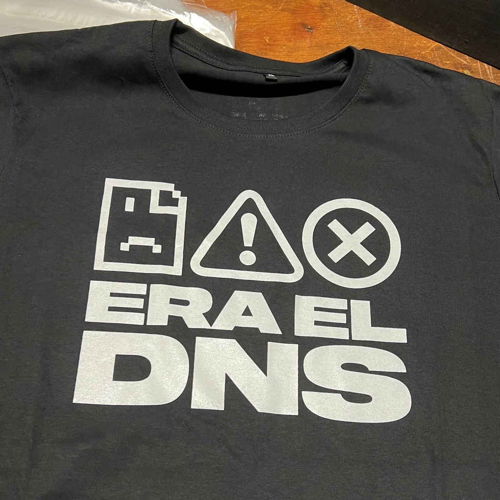
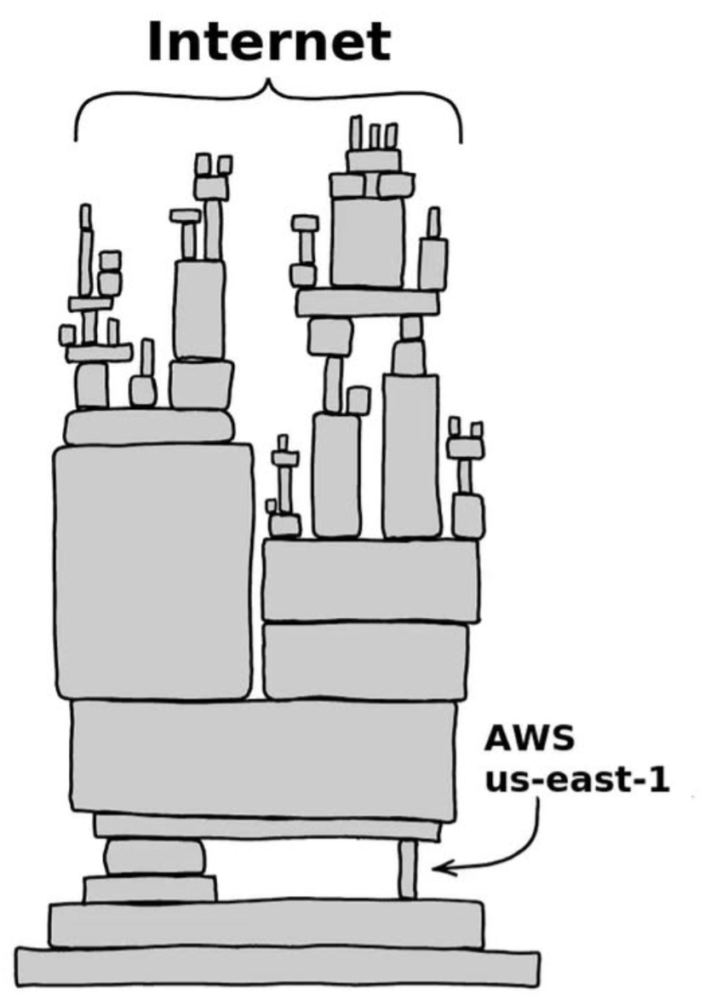

## El talón de Aquiles de Internet

Bueno, al menos uno de los talones, pero una analogía con más de dos talones no quedaría bien... bah... hoy en día...

Cerrando el mes y ya pasados varios días de la caída de AWS (y como lo acompañó Azure hace menos) con muchos posts, opiniones, memes, videos, tiktoks y demás yerbas hablando de DNS, que yo también quiero ser popular.

**IMPORTANTE:** SI NO SABÉS QUÉ ES UN **DNS**, EN ALGÚN MOMENTO LO VOY A EXPLICAR (de todos modos, eso quiere decir que entraste por el chisme, eso me agrada).

En fin, pasando los días pienso que ya deberíamos tener un registro avalado por la comunidad donde llevemos la cuenta de cuántas veces pasan cosas y decimos "fue un problema de DNS". Ya es tan cliché esto que tenemos wallpapers, chistes entre sectores, remeras (como la de Sysarmy), etc.

### ¿Que paso con AWS?

Creo que no hay nada que contar que no hayan leído en otra parte, pero si los memes diarios te taparon las novedades de AWS... Acá va un resumen.

AWS (como cualquier proveedor de servicios grande) tiene muchos centros de datos distribuidos por el mundo. Uno de los más grandes de estos muchachos es el que está ubicado en el norte de Virginia.

En teoría (sí, en teoría, en teoría el comunismo funciona, en teoría), los centros de datos tienen toda la tecnología, múltiples enlaces, electricidad redundante, un montón de protocolos, sistemas de refrigeración modernos y redundantes, y muchas cosas más.

Pero bueno, mientras más dura es la armadura, más fácil es partirla. Y solo bastó con una falla en el DNS. Opinión: Alguien se mandó un moco (para no decir que alguien se va a quedar sin laburo).

Los muchachones de Amazon lo resolvieron en cuestión de unas horas, pero cualquier falla en un proveedor de servicios de semejante magnitud, con clientes de igual o mayor magnitud o valor de mercado, hace un efecto bola de nieve que lleva un buen rato solucionar.

En fin, no me interesa tanto hablar del que sino reflexionar sobre esto:

Pero, antes vamos a explicar rápidamente cómo funciona un DNS, que no quiero perder a nadie en el camino.

## ¿Qué es el DNS explicado para el pibe de sistemas que lo mandan a hacer café?

Acá es donde entra la analogía que tanto odio:

> *"Es como una guía telefónica de Internet"*

Por favor, basta de la misma analogía, hagámosla más épica. Así que vamos a explicarlo como me gusta, con cosas de fantasía. Acá quiero meter Warhammer obviamente, pero antes, una que todas puedan seguir:

> Internet es un multiverso de servidores y servicios. El DNS es el mapa que te dice cómo llegar a cada dimensión. Sin él, estás perdido en el vacío.

¿Viste? Suena sencillo, si un día te creíste hacker poniendo en tu PC el DNS 8.8.8.8 (Google) o cambiando el DNS por el de Cloudflare (1.1.1.1) o alguno que viste en un video de YouTube con Loquendo, lo que estabas haciendo es decirle a tu PC cuál es ese mapa (servidor DNS) que le va a permitir ingresar a donde querés.

Justamente, actualmente estás en [blog.cundalf.com.ar](https://blog.cundalf.com.ar), en tu lindo navegador pusiste eso (por suerte mi página no empieza con x), bueno, tu navegador le tuvo que preguntar a alguien cómo llegar a *blog.cundalf.com.ar*.

¿No fui claro? Bueno, preguntale a una IA master.

¡AHORA SÍ! analogía de Warhammer 😄 *(obviamente le pedí a una IA, soy nerd pero también soy vago)*

> En la era del Milenio Digital, donde los datos fluyen como almas por la disformidad, existe una señal sagrada que guía a los navegantes a través del inmenso vacío de direcciones: el DNS. Como el Astronomicón del Imperio, su luz permite que los paquetes crucen el warp de la red sin perderse en el caos. Pero cuando esa señal se apaga, incluso los más poderosos servidores quedan a la deriva, atrapados en bucles de resolución fallida y ecos de dominios perdidos.
> 
> Los acólitos del Adeptus Mechanicus ejecutan rituales de resolución con precisión milimétrica, invocando nombres verdaderos desde códices sagrados para traducirlos en coordenadas IP. Cada consulta es una plegaria al Omnissiah, y cada respuesta, una bendición. Pero si el ritual se corrompe, los mundos forja quedan aislados, como planetas perdidos en el Ojo del Terror.
> 
> Sin el DNS, ni el Martillo del Emperador puede golpear su objetivo (¡NO ES HEREJIA!). Los paquetes disparados al vacío erran sin rumbo, como torpedos sin sistema de puntería. Y así, el tráfico digital se hunde en la disformidad: direcciones que no llevan a ningún lado, entidades que responden desde lugares que no deberían existir, y usuarios que vagan sin guía, como peregrinos sin mapa.
> 
> El DNS no es solo un servicio. Es el guardián del portal, el grimorio de los nombres verdaderos, el mapa del multiverso digital. Y cuando falla… el Imperio entero tiembla.

## Un poco de historia

Estas caídas culpando al DNS pueden ser nuevas para algunos, pero para los que estuvimos o fuimos parte del mundo de la Infraestructura, no es nada nuevo. Ahora, para los que se enteran solo cuando no funciona Mercado Pago, Instagram o Pornhub (y para los olvidadizos), recorramos juntos algunas caídas memorables.

### 2016: Dyn – Ataque DDoS masivo

**Qué pasó:** Dyn, un proveedor clave de DNS, fue atacado con un DDoS usando el botnet Mirai, compuesto por miles de dispositivos IoT inseguros.

**Impacto:** Sitios como Twitter, Netflix, Reddit, GitHub, Spotify y Airbnb quedaron inaccesibles durante horas en EE. UU. y Europa.

**Lección:** Un único punto de falla en DNS puede tumbar gran parte de Internet.

### 2020: Cloudflare – Error de configuración

**Qué pasó:** Una actualización interna en la red backbone de Cloudflare provocó que gran parte de su infraestructura DNS quedara fuera de línea.

**Impacto:** Miles de webs y servicios globales dejaron de resolver, incluyendo medios, e-commerce y SaaS.

**Lección:** No solo los ataques, también los errores humanos de configuración pueden escalar a fallas globales.

### 2018: Google Public DNS (El oooochoooooo) – Fuga de rutas BGP

**Qué pasó:** Un ISP en Nigeria (MainOne) filtró rutas incorrectas que desviaron tráfico de Google Public DNS hacia China y Rusia.

**Impacto:** Millones de usuarios experimentaron lentitud o imposibilidad de resolver dominios.

**Lección:** La combinación de BGP + DNS es explosiva: un error de enrutamiento puede secuestrar tráfico crítico.

### 2009: TLD .se (Chisme de Suecia) – Error en DNSSEC

**Qué pasó:** Un error en la firma DNSSEC del dominio de nivel superior .se dejó a todos los dominios suecos inaccesibles.

**Impacto:** Bancos, medios y servicios digitales suecos quedaron fuera de línea durante horas.

**Lección:** La seguridad mal implementada (DNSSEC) puede ser tan peligrosa como la falta de seguridad.

### 2025: AWS US-East-1 - Estamos aquí

**Qué pasó:** Una falla interna en el monitoreo de balanceadores de carga en el datacenter de N. Virginia disparó errores de resolución DNS.

**Impacto:** Bancos, aerolíneas, e-commerce y hasta dispositivos domésticos inteligentes quedaron inoperativos por horas.

**Lección:** La concentración de servicios en un solo proveedor hace que un fallo de DNS tenga efecto dominó global.

### 2025: Azure - Caída global por DNS (¿double kill?)

**Qué pasó:** Una mala configuración en Azure Front Door provocó una disrupción masiva en la resolución DNS de servicios clave.

**Impacto:** Usuarios y empresas perdieron acceso a Microsoft 365, Azure Portal, Outlook, Xbox Live y más durante varias horas.

**Lección (supongo):** Incluso en infraestructuras de clase mundial, un error de DNS puede escalar a una caída global que afecta autenticación, tráfico y disponibilidad.

## Fin

En fin, no sé si compartí algo útil, pero al menos me divertí armando esto, recordando cosas y viendo memes. Aunque bueno, laboralmente no fue tan divertido 🫤

Bye!
